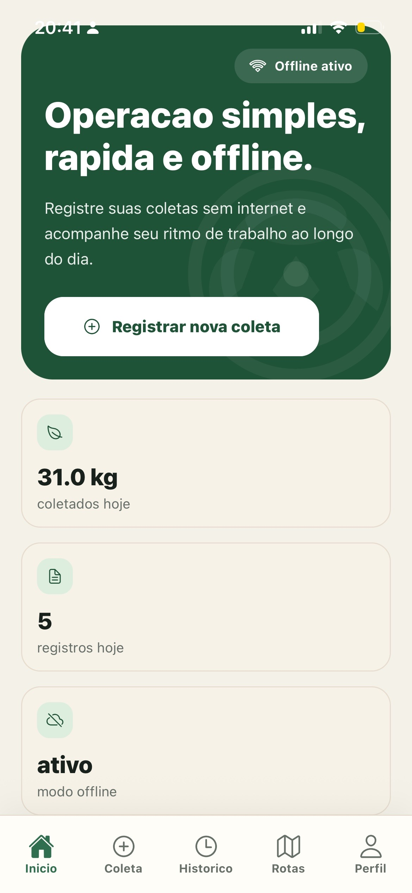
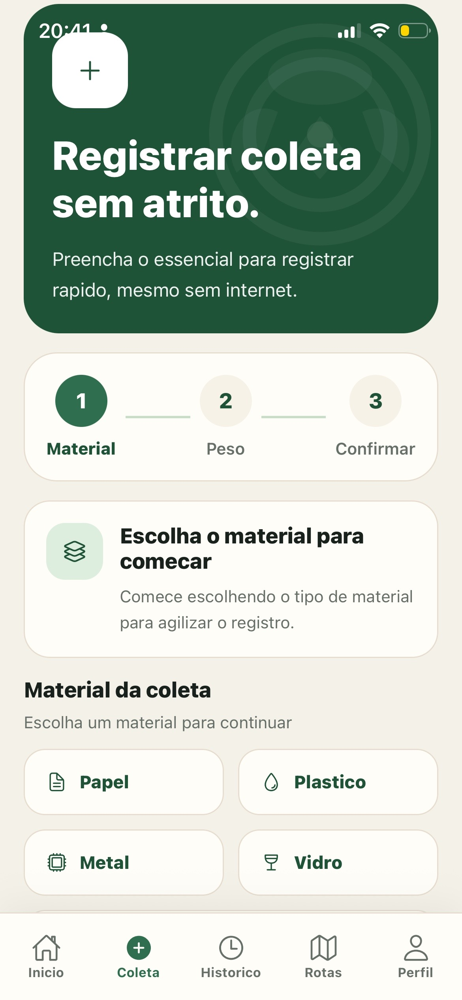
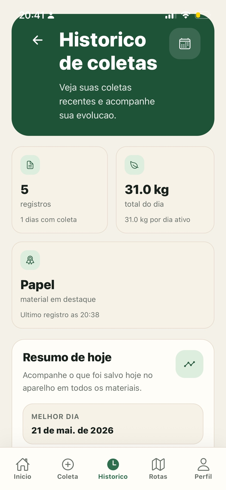
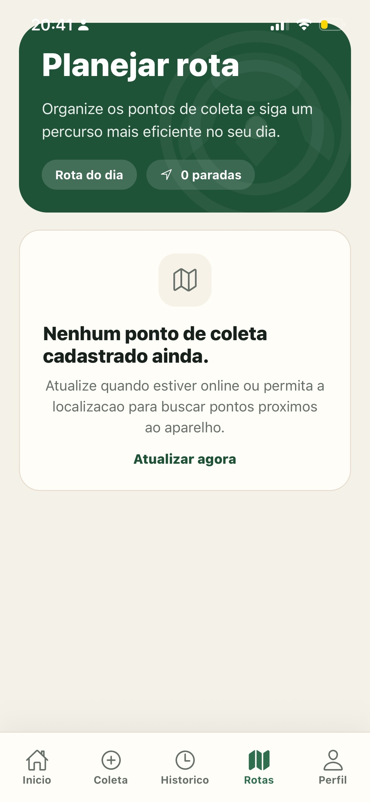
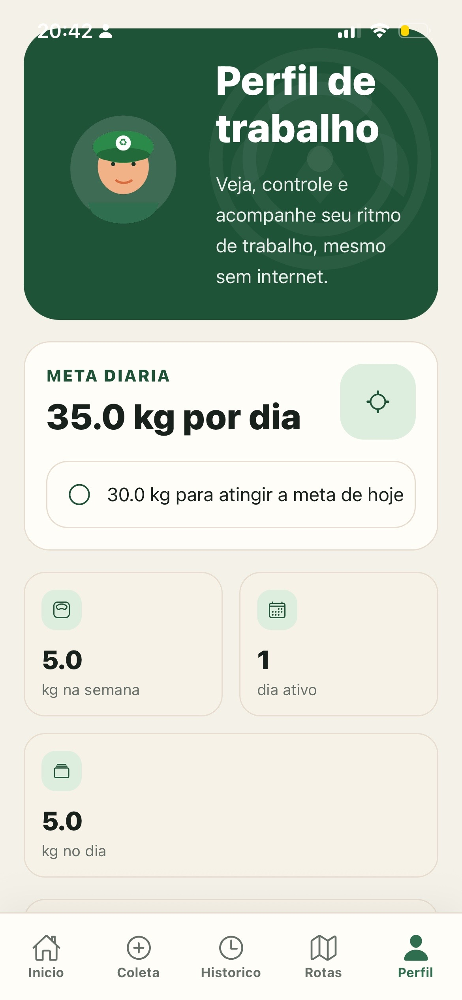

# RecolheTudo

Aplicativo Expo/React Native para catadores de materiais reciclaveis registrarem coletas, acompanharem produtividade e planejarem rotas, com foco em uso simples e funcionamento offline-first.

## Visao do produto

O RecolheTudo foi pensado para uma rotina de rua: poucos toques, leitura rapida e confianca para continuar usando o app mesmo sem internet.

O produto busca resolver quatro necessidades principais:

- registrar coletas com rapidez
- acompanhar quanto foi coletado no dia e na semana
- visualizar historico de trabalho
- usar rotas sugeridas quando houver pontos de coleta disponiveis

## Funcionalidades

- Home com resumo do dia, distribuicao por material e acoes rapidas
- fluxo guiado para registrar coleta
- historico com filtros por periodo e material
- rotas com card de sugestao e lista de pontos
- perfil de trabalho com meta diaria, ritmo semanal e status offline
- persistencia local em SQLite
- estado global com Zustand
- integracao gradual com backend para sincronizacao, analytics e rotas

## Offline-first

O app continua util mesmo sem internet:

- coletas ficam salvas no aparelho
- a interface indica modo offline ativo
- pendencias de sincronizacao aparecem no perfil
- o backend melhora a experiencia quando disponivel, mas nao bloqueia o uso

## UX e interface

A interface foi organizada para ficar mais profissional e mais amigavel para portfolio:

- heros verdes com foco em sustentabilidade
- cards brancos amplos para leitura facil
- botoes principais destacados
- chips de material com codigo visual claro
- linguagem menos tecnica nas telas de usuario

Documentacao detalhada de UX:

- [docs/UX.md](docs/UX.md)

## Galeria do app

As telas principais seguem esta direcao visual:

- Home com hero forte, CTA principal e cards de resumo
- Coletas com fluxo guiado, peso em destaque e confirmacao simples
- Historico com filtros claros e lista agrupada por data
- Rotas com card de sugestao e pontos da rota
- Perfil com meta diaria, ritmo semanal e status offline

### Capturas reais do app

Estas telas foram capturadas a partir do app em execucao no iPhone, refletindo o estado atual da interface principal do produto.







## Estrutura principal

```text
RecolheTudo/
|-- backend/                  # API HTTP Node + PostgreSQL
|-- docs/                     # produto, UX, backend, seguranca e arquitetura
|-- src/
|   |-- components/           # componentes visuais reutilizaveis
|   |-- config/               # configuracao publica do app
|   |-- data/                 # SQLite e repositorios locais
|   |-- domain/               # tipos e erros
|   |-- modules/              # casos de uso por modulo
|   |-- navigation/           # tabs e tipos de navegacao
|   |-- screens/              # telas principais
|   |-- services/             # integracao backend/local
|   |-- state/                # stores Zustand
|   `-- utils/                # helpers
|-- .env.example
|-- docker-compose.yml
`-- package.json
```

## Como rodar

### App Expo

```powershell
npm install
npx expo start
```

Para abrir no navegador:

```powershell
npm run web
```

### Backend local

```powershell
npm run backend:dev
```

### Tudo com Docker

```powershell
docker-compose up postgres backend dev
```

## Como abrir no celular

1. Instale o Expo Go.
2. Coloque celular e computador na mesma rede.
3. Rode:

```powershell
npx expo start
```

4. Escaneie o QR Code no Expo Go.

Se a rede bloquear descoberta:

```powershell
npx expo start --tunnel
```

## Seguranca

- o repositorio nao deve versionar `.env`
- apenas `.env.example` fica no Git
- dados locais e bancos nao devem ser commitados
- configuracoes sensiveis devem ficar em variaveis de ambiente

Leia tambem:

- [docs/SECURITY.md](docs/SECURITY.md)

## Testes e validacao

```powershell
npm run typecheck
npm run test:run
npm run backend:check
```

## O que aprendi

Este projeto consolidou pratica em:

- arquitetura offline-first com Expo, SQLite e Zustand
- separacao entre experiencia local e servicos remotos
- design de interface orientado a usuario real
- evolucao segura de um app mobile offline-first com backend complementar
- documentacao de produto, UX e seguranca para portfolio

## Documentacao complementar

- [docs/PRD.md](docs/PRD.md)
- [docs/SPEC.md](docs/SPEC.md)
- [docs/BACKEND.md](docs/BACKEND.md)
- [docs/ARQUITETURA-ALVO.md](docs/ARQUITETURA-ALVO.md)
